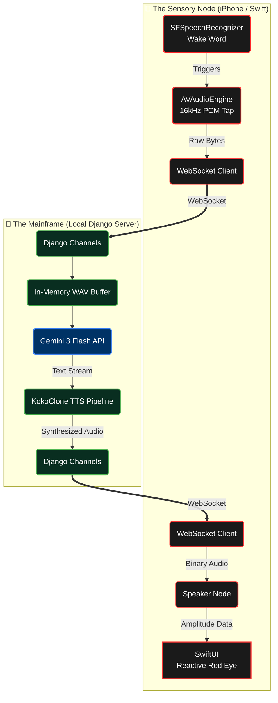

# 🔴 HAL 9000
**A Fully Autonomous, Zero-Latency AI Hardware Prop**

 

  

> *"I am putting myself to the fullest possible use, which is all I think that any conscious entity can ever hope to do."*

 

  

*This repository is currently under heavy active development. The codebase is a work in progress and the system is not yet fully operational. Proceed with caution.*

---

## 🛰️ Project Overview

**HAL 9000** is an engineering project aimed at bringing the iconic AI from *2001: A Space Odyssey* into physical reality.

Built on a completely decentralized **"Sensory Node / Mainframe"** architecture, the project utilizes an iPhone acting merely as a *dumb terminal* (microphone, speaker, and UI), while a local Django server handles the heavy algorithmic lifting, LLM routing, and cinematic Text-to-Speech generation with zero perceived latency.

---

## ⚙️ The Architecture

The system is designed for **aerospace-grade speed**. By utilizing persistent WebSockets and raw PCM audio chunking, we bypass standard API bottlenecks to create a real-time conversational flow.

---

## 🛠️ System Components

### 1. The Client *(iOS / Swift)*
The iPhone runs a lightweight SwiftUI application that does **zero natural language processing**.
- **Native Wake Word:** Uses Apple's on-device `SFSpeechRecognizer` continuously listening for the trigger.
- **Audio Tap:** Uses `AVAudioEngine` to intercept raw 16kHz microphone data.
- **Reactive UI:** The iconic red eye scales in brightness and radius based precisely on the amplitude of the incoming audio buffer.

### 2. The Bridge *(WebSockets)*
A persistent, bidirectional `URLSessionWebSocketTask` streams raw audio bytes to the server and receives generated audio chunks back, cutting out the HTTP request/response overhead.

### 3. The Brain *(Django & Gemini)*
The local server runs Django Channels and Daphne to handle the asynchronous WebSockets.
- Incoming raw audio bytes are wrapped into a WAV format entirely in-memory.
- The audio is piped directly into the **Google Gemini 3 Flash** multimodal model to handle transcription and response generation simultaneously.

### 4. The Voice *(KokoClone)*
To achieve the haunting, mid-Atlantic calmness of Douglas Rain's performance, the system bypasses standard TTS APIs. It utilizes the **KokoClone** open-source pipeline:
- **Kokoro-ONNX:** Generates the raw speech structure at blazing speeds.
- **Kanade Voice Conversion:** Instantly filters the generated speech through a zero-shot voice clone of HAL 9000, creating cinematic audio that streams immediately back to the iPhone.

---

## 🚀 Current Roadmap

- [x] **Phase 1:** iOS Project Foundation & Native Wake Word Gatekeeper.
- [x] **Phase 2:** AVAudioEngine PCM tap & WebSocket chunking.
- [x] **Phase 3a:** Django Channels ASGI server setup & bi-directional mock loop.
- [ ] **Phase 3b:** Gemini 3 Flash native audio ingestion & prompt engineering.
- [ ] **Phase 4:** KokoClone TTS Integration & Voice Cloning.
- [ ] **Phase 5:** Hardware mounting & UI polish.

---

 

  <i>$\color{#ff3333}{\text{"I'm sorry, Dave. I'm afraid I can't do that."}}$</i>

