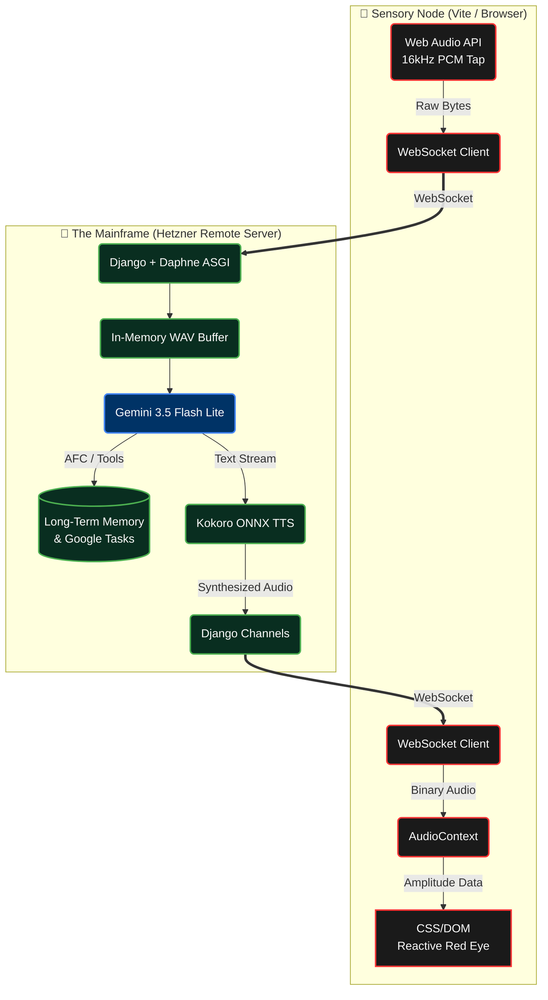

# 🔴 HAL 9000
**A Fully Autonomous, Zero-Latency AI Hardware Prop**

 

 

> *"I am putting myself to the fullest possible use, which is all I think that any conscious entity can ever hope to do."*

 

---

<h2 align="center">🛰️ Project Overview</h2>

**HAL 9000** is an engineering project aimed at bringing the iconic AI from *2001: A Space Odyssey* into physical reality. 

Initially designed as a localized Swift application, the architecture has evolved into a highly robust, universally accessible **Web Application and Remote Mainframe** model. Any device with a modern browser (primarily an iPhone inside a 3D-printed enclosure) serves as the Sensory Node (microphone, speaker, and UI), while a remote production server handles the heavy algorithmic lifting, LLM routing, memory management, and cinematic Text-to-Speech generation with **near-zero perceived latency**.

---

<h2 align="center">⚙️ The Architecture</h2>

The system is designed for **aerospace-grade speed**. By utilizing persistent WebSockets and raw PCM audio chunking, we bypass standard API bottlenecks to create a fluid, real-time conversational flow.

---

<h2 align="center">🛠️ System Components</h2>

> **1. The Client (Vite Web App)**
> 
> A lightweight, highly optimized web application designed to run permanently in a browser environment (with Screen WakeLock) mimicking a native app.
> - **Continuous Listening:** Captures audio and streams raw 16kHz PCM data.
> - **Reactive UI:** The iconic red eye scales in brightness and radius based precisely on the amplitude of the incoming user and HAL audio buffers.
> - **Enclosure Mode:** Includes a hidden diagnostic UI and specific touchscreen calibration features for mounting inside a physical 3D-printed prop.
> - **Hardware Sleep Mode:** Dynamically dims the OLED screen to conserve power when commanded.

> **2. The Bridge (WebSockets)**
> 
> A persistent, bidirectional WebSocket connection streams raw audio bytes to the remote server and receives synthesized audio chunks back, entirely cutting out standard HTTP polling overhead.

> **3. The Brain (Django & Gemini)**
> 
> The remote production server (`hal.tuning.net`) runs **Django Channels** and the **Daphne** ASGI server to handle thousands of asynchronous WebSocket frames.
> - **Automatic Function Calling (AFC):** Powered by **Google Gemini 3.5 Flash Lite**, HAL natively interfaces with the real world, including adding and removing items from Google Tasks (Shopping Lists) and dynamically injecting exact local time on every interaction.
> - **Long-Term Memory:** Background threads continuously summarize conversation history and consolidate it into a persistent database to grant HAL infinite contextual recall.

> **4. The Voice (Kokoro ONNX)**
> 
> To achieve the haunting, mid-Atlantic calmness of Douglas Rain's performance with minimal latency, the system utilizes the **Kokoro ONNX** engine running directly on the backend. Text tokens are instantly streamed into the TTS engine, generating cinematic audio chunks that are immediately fired back down the WebSocket.

---

<h2 align="center">🚀 Current Roadmap</h2>

| Phase | Module | Status |
| :---: | :--- | :---: |
| **01** | Initial iOS Prototype & Wake Word | 🔴 Abandoned |
| **02** | Pivot to Vite Web App & Audio Pipeline | 🟢 Done |
| **03** | Django Channels ASGI server setup & bi-directional loop | 🟢 Done |
| **04** | Gemini 3.5 Flash Lite integration & Kokoro TTS | 🟢 Done |
| **05** | Long-Term Memory & Google Tasks Automation | 🟢 Done |
| **06** | Enclosure Calibration, Time-sync, & Sleep mode | 🟢 Done |
| **07** | Proactive System Interventions (Battery Bridge) | 🟡 In Progress |

 
 

> *"I'm sorry, Fab. I'm afraid I can't do that."*

